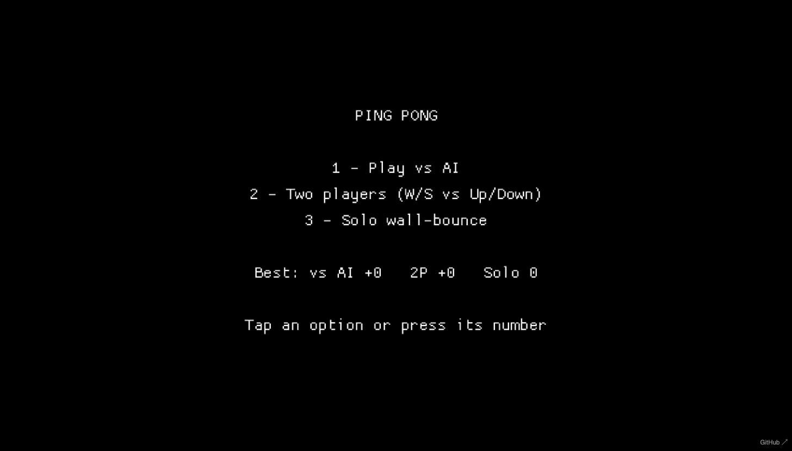

# Ping Pong

Pong, written in Rust with [macroquad](https://macroquad.rs). Runs natively or in the browser via WebAssembly.



## Modes

- **1 — Play vs AI**: you (left paddle) against a computer opponent.
- **2 — Two players**: left vs right on the same keyboard.
- **3 — Solo wall-bounce**: no opponent, the right wall bounces the ball back; see how many hits you can survive.

First to 5 points wins (vs AI / two player). The ball rests against whichever paddle is serving — move that paddle to launch it.

## Controls

| Player       | Up   | Down |
|--------------|------|------|
| Left paddle  | `W`  | `S`  |
| Right paddle | `↑`  | `↓`  |

In vs-AI and solo modes (only one human paddle in play), either key layout works for the left paddle.

`1`/`2`/`3` to pick a mode from the menu, `Space` to return to the menu from the game-over screen.

On touch screens: tap a menu option to start, hold a finger where you want your paddle to go (in two-player, each player owns their half of the screen), and tap to leave the game-over screen. Works in both orientations — in portrait the court rotates so your green paddle is at the bottom and the AI's red paddle at the top. Paddles are color-coded, with a legend under the score (green YOU vs red AI, or green P1 vs orange P2). Exit and Pause/Resume buttons sit top-left during play; `Esc` also toggles pause.

## Running natively

```sh
cargo run --release
```

## Running in the browser

The WASM build and browser shim (`index.html`, `mq_js_bundle.js`) are already checked in. Rebuild after changing game code:

```sh
cargo build --release --target wasm32-unknown-unknown
cp target/wasm32-unknown-unknown/release/ping-pong.wasm .
```

Then serve the project root and open it:

```sh
python3 -m http.server 8080
# open http://localhost:8080/index.html
```

## Tests

```sh
cargo test
```
